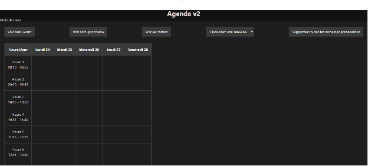
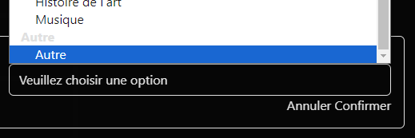

# Dossier de Projet : Agenda en Ligne

[https://xpeuvr327.github.io/agenda-concours/](https://xpeuvr327.github.io/agenda-concours/)  

## Énoncé du problème

Les étudiants ont souvent du mal à suivre leurs cours et événements sans un agenda organisé. Les agendas traditionnels peuvent être fastidieux à utiliser, et il n'existe pas de solution simple, gratuite, et open-source pour gérer les emplois du temps.

## Démarche effectuée pour le résoudre

J'ai développé une application d'agenda en ligne qui permet aux utilisateurs d'ajouter, modifier et consulter leurs cours et devoirs de manière intuitive. L'application est conçue pour être accessible sur tous les appareils disposant d'un navigateur moderne.

## Contenu de l'application

L'application est un agenda en ligne qui permet de :

- Ajouter des cours ou événements dans un calendrier.
- Modifier ou supprimer des évènements existants.
- Personnaliser les éléments (par exemple, ajouter des salles ou des devoirs spécifiques).
- Consulter l'agenda de manière claire et organisée.
- Ajouter des devoirs.
- Voir tous les devoirs.
- Exporter les données.
- Supprimer des données.

## Mention du type d'appareil et OS

- **Appareils compatibles** : Tout appareil disposant d'un navigateur compatible avec ES2015 ou version ultérieure.
- **Systèmes d'exploitation testés** :
  - Android (versions 11, 12, 13, 14, et devrait fonctionner à partir de la version 8 avec le navigateur par défaut, et 6 avec un navigateur mis à jour et rétroporté).
  - iOS 18.1 (devrait fonctionner à partir de iOS 11).
  - Windows (testé sur Windows 10 et 11, devrait fonctionner sur la plupart des OS avec Firefox).
  - Mac (testé sur macOS Catalina, devrait fonctionner sur des versions plus anciennes et plus récentes).
- **Navigateurs incompatibles testés**:
  - Navigateur PS4 (version système 9.x)
  - Opera Mini 7 sous Symbian S60 v5
  - Wii Internet Channel (basé sur Opera)

## Nom des logiciels ayant servi au développement

- **Navigateur** : Chrome (versions 131-132)
- **Environnement de développement** : Visual Studio Code (versions 1.96/97/98)
- **Solution Git** : GitHub (CLI/Web)
- **Mistral AI API**

## Manuel d'utilisation

### Introduction

Ce court manuel permettra vous permettra de découvrir les fonctionnalités principales de l'application à travers une démo des différentes fonctionnalités.

### 1. Ajouter un élément à l'agenda

1. **Ouvrez l'application** : Accédez à l'application via votre navigateur, via l'URL: [https://xpeuvr327.github.io/agenda-concours/](https://xpeuvr327.github.io/agenda-concours/) (ce devrait être l'URL sur laquelle vous visionnez ce site)

2. **Sélectionnez une case** : Cliquez sur une case dans le calendrier pour ajouter un nouvel élément.
     
3. **Ajoutez les détails** :
   - Entrez le nom de l'élément (par exemple, "Mathématiques").

     

   - Si l'élément n'est pas listé, cliquez sur "Autre" pour en créer un nouveau.

     

   - Entrez la salle ou le lieu de l'événement.

     

   - Si l'élément dure 2 heures, et que vous y êtes invité, cochez l'option correspondante. Ok dupliquera l'évènement sur les deux autres heures, Cancel sauvegardera l'évènement sur l'heure à laquelle elle a été créée.
     

### 3. Ajouter un devoir
1. **Sélectionnez une période**: Cliquez sur une prédiode sur laquelle vous voulez ajouter un devoir.

2. **Sélectionnez Ajouter un devoir**: Cliquez sur le texte "Ajouter un devoir" afin d'ajouter un devoir.

3. **Entrez votre contenu**: Entrez le contenu souhaité, par exemple:

### 4. Voir tous les devoirs
1. **Appuyez sur "Voir les tâches"**: Dans le panneau de naviagation, appuyer sur le bouton "Voir les tâches" dans la barre de navigation supérieure

2. **Consultez vos tâches**: Vous pouvez voir les différentes tâches que vous avez créées.

3. **Triez les tâches par semaine**: Vous pouvez appuyer sur les différents choix de semaine afin de trier et de ne voir qu'une certaine semaine.

### 4. Supprimer un élément

1. **Sélectionnez l'élément** : Cliquez sur l'élément que vous souhaitez supprimer.
2. **Supprimez** : Cliquez sur "Supprimer".
3. **Confirmez** : Confirmez la suppression en appuyant sur Ok si vous êtes sûr de vouloir supprimer l'évènement. L'action est irrécupérable.

### 5. Modifier un élément existant

1. **Sélectionnez l'élément** : Cliquez sur l'élément que vous souhaitez modifier dans le calendrier.
2. **Sélectionnez "Modifier"** : Le processus est alors le même que si on créait un nouvel élément.
### 6. Consulter l'agenda

1. **Naviguez dans le calendrier** : Utilisez les boutons de navigation pour passer d'une semaine à l'autre.

2. **Utilisez le menu déroulant**: Utilisez le menu déroulant afin de naviguer encore plus rapidement! Le choix de la semaine est confirmé lorsque vous sélectionnez l'option.
 
3. **Avancé**: Utilisez les paramètres de recherche afin de créer / accéder à une semaine. Exemple: [https://xpeuvr327.github.io/agenda-concours/index.html?week=1000](https://xpeuvr327.github.io/agenda-concours/index.html?week=1000).
### 7. **Importer / Exporter des données**: 
1. **Exporter des données**: La méthode pour **exporter la semaine courante** est de simplement appuyer sur le bouton correspondant. 

Les données sont également disponibles sous localStorage/week*n*.
2. **Importer des données**: Appuyer sur Sélectionner un fichier de Planning Suivant Sélectionner le fichier JSON d'intérêt 

## Code source du projet

Le code source de l'application est fourni par GitHub dans le repo [xpeuvr327/agenda-concours](https://github.com/xpeuvr327/agenda-concours)  
Le listing des sources (pertinentes) est le suivant:
- index.html
- main.js
- styles.css
- data/timedefault.json
 ## Coordonnées de l'auteur

- **Auteur** :
  - GitHub : [@xpeuvr327](https://github.com/xpeuvr327)
  - Nom : Nguyen Phuc-Bao
  - Courriel : phucbaodomi@gmail.com
